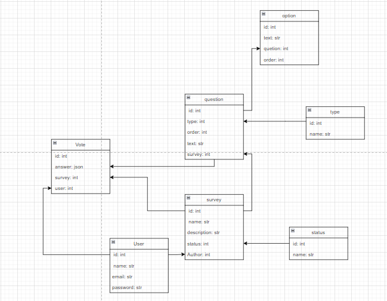

<h1>Тема - Сервис для выполнения опросов</h1>
<h2>Автор - Далжин Яков</h2>

стек - node+express+prisma+Typescript

<h3>Роли:</h3>
<ol>
    <li><strong>RESPONDENT</strong> (Респондент)
        <ul>
            <li>Просмотр списка опубликованных опросов</li>
            <li>Прохождение опросов (отправка ответов)</li>
            <li>Защита от повторного прохождения одного опроса</li>
        </ul>
    </li>
    <li><strong>AUTHOR</strong> (Автор)
        <ul>
            <li>Создание нового опроса (статус Черновик)</li>
            <li>Редактирование заголовка и описания опроса</li>
            <li>Добавление вопросов к опросу</li>
            <li>Редактирование структуры опроса только в статусе «Черновик»</li>
            <li>Публикация опроса (перевод в статус Опубликовано)</li>
            <li>Закрытие опроса (перевод в статус Закрыт)</li>
            <li>Просмотр аналитики своих опросов (количество респондентов, проценты)</li>
            <li>Экспорт результатов опроса в JSON</li>
            <li>Удаление/архивация своих опросов</li>
        </ul>
    </li>
</ol>

<h3>Эндпоинты:</h3>
<ol>
    <li><strong>Авторизация и Профиль</strong>
        <ul>
            <li>POST - /auth/register - Регистрация нового пользователя</li>
            <li>POST - /auth/login - Вход в систему</li>
            <li>POST - /auth/logout - Выход из системы</li>
            <li>GET - /profile - Получение информации о пользователе</li>
            <li>PATCH - /profile - Обновление данных профиля</li>
        </ul>
    </li>
    <li><strong>Опросы (Публичные / Респондент)</strong>
        <ul>
            <li>GET - /surveys - Вывод списка всех опубликованных опросов</li>
            <li>GET - /surveys/:id - Получение информации конкретного опроса</li>
            <li>GET - /surveys/:name - Поиск опроса по уникальному имени</li>
            <li>POST - /surveys/:id/submit - Отправка ответов на опрос</li>
            <li>GET - /surveys/:id/status - Проверка статуса прохождения (доступен/пройден)</li>
        </ul>
    </li>
    <li><strong>Управление опросами (Автор)</strong>
        <ul>
            <li>GET - /surveys/my - Список опросов, созданных текущим автором</li>
            <li>POST - /surveys - Создание нового опроса (Черновик)</li>
            <li>PATCH - /surveys/:id - Редактирование опроса (вопросы, текст)</li>
            <li>POST - /surveys/:id/publish - Публикация опроса (Черновик → Опубликовано)</li>
            <li>POST - /surveys/:id/close - Закрытие опроса (Опубликовано → Закрыт)</li>
            <li>DELETE - /surveys/:id - Удаление или архивация опроса</li>
        </ul>
    </li>
    <li><strong>Аналитика и Результаты (Автор)</strong>
        <ul>
            <li>GET - /surveys/:id/analytics - Статистика по опросу (проценты, количество)</li>
            <li>GET - /surveys/:id/export - Экспорт результатов опроса в JSON</li>
            <li>GET - /surveys/:id/responses - Просмотр детальных ответов респондентов</li>
        </ul>
    </li>
</ol>